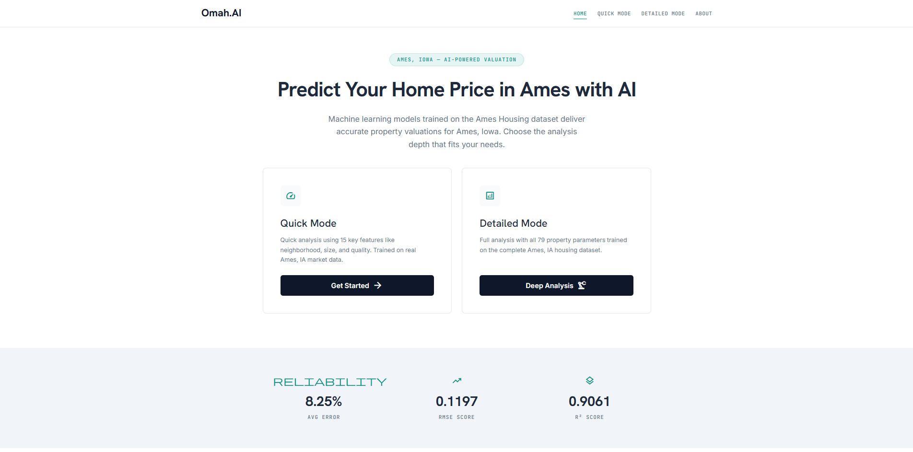

# 🏠 Ames House Price Prediction

An end-to-end data science project that predicts house prices using machine learning, from data exploration to a deployed web application.

**🔗 Live App:** [https://ames-house-price-prediction-0f33.onrender.com/](https://ames-house-price-prediction-0f33.onrender.com/)



---

## 📊 Overview

This project predicts house prices in Ames, Iowa based on 79 explanatory variables describing residential homes. The workflow covers the complete data science pipeline:

1. **Data Cleaning** — Handle missing values, remove duplicates
2. **Feature Engineering** — Create new features, encode categorical variables
3. **Model Training** — Train and evaluate multiple regression models
4. **Model Deployment** — Deploy as a web application on Render

---

## 📁 Project Structure

```
house-prices-prediction/
│
├── data/
│   ├── raw/                    # Original dataset (do not modify)
│   │   ├── train.csv
│   │   └── test.csv
│   ├── processed/              # Cleaned dataset
│   │   ├── cleaned_train.csv
│   │   └── cleaned_test.csv
│   ├── features/               # Dataset after feature engineering
│   │   ├── featured_train.csv
│   │   └── featured_test.csv
│   ├── submission/             # Kaggle submission files
│   │   └── submission.csv
│   └── data_description.txt    # Dataset documentation
│
├── notebooks/
│   ├── data_cleaning.ipynb         # Step 1: Data cleaning
│   ├── feature_engineering.ipynb   # Step 2: Feature engineering
│   └── modeling.ipynb              # Step 3: Model training & evaluation
│
├── assets/
│   └── homepage.png            # Screenshot of the web app homepage
│
├── app/                        # FastAPI web application
│   ├── main.py                 # App entrypoint & routes
│   ├── model.py                # Model loading & prediction logic
│   ├── model_download.py       # Download model from GitHub Releases
│   ├── features.py             # Feature engineering pipeline
│   ├── schemas.py              # Pydantic models for API
│   ├── feature_data.py         # Form field definitions
│   ├── templates/              # Jinja2 HTML templates
│   │   ├── components/         # Shared partials (navbar, btn_predict, result_banner)
│   │   ├── index.html          # Homepage
│   │   ├── simple.html         # Quick Mode
│   │   ├── detail.html         # Detailed Mode
│   │   └── about.html          # About page
│   └── static/
│       ├── css/
│       │   ├── input.css       # Tailwind v4 source (theme tokens)
│       │   └── tailwind.css    # Generated build output (committed for Render)
│       └── js/
│           ├── navbar.js       # Mobile hamburger menu
│           ├── detail.js       # Scroll-spy + back-to-top
│           ├── simple.js       # Quick Mode form
│           ├── form_loading.js # Predict button loading state
│           └── home.js         # Homepage stats animation
│
├── models/
│   └── preprocessing_pipeline.pkl  # Preprocessing pipeline (17KB)
│   # stacking_regressor.pkl downloaded at runtime from GitHub Releases
│
├── tests/
│   ├── test_model_download.py    # Unit tests for model download
│   ├── test_schemas.py           # SimpleHouseInput validation tests
│   ├── test_templates.py         # Template regression tests
│   ├── detail-scroll-spy.test.js # Scroll-spy behavior (node)
│   └── form-loading.test.js      # Predict loading state (node)
│
├── requirements.txt            # Python dependencies
├── package.json                # Tailwind v4 build config
├── package-lock.json
├── Procfile                    # Render start command
└── render.yaml                 # Render service config
```

---

## 🚀 Quick Start

### Option 1: Run Locally

```bash
# Clone the repository
git clone https://github.com/AkmalFazli27/house-prices-prediction.git
cd house-prices-prediction

# Create virtual environment
python -m venv venv
venv\Scripts\activate          # Windows
# source venv/bin/activate    # macOS/Linux

# Install dependencies
pip install -r requirements.txt

# Install Tailwind CSS dev dependencies
npm install

# Build the CSS bundle
npm run build

# NOTE: commit the regenerated app/static/css/tailwind.css along with your
# template/input.css changes — Render has no Node.js, so it deploys the
# pre-built CSS directly.

# Run the app
uvicorn app.main:app --reload --port 8000
```

Open [http://127.0.0.1:8000](http://127.0.0.1:8000) in your browser.

### Option 2: Use the Live App

Visit [https://ames-house-price-prediction-0f33.onrender.com/](https://ames-house-price-prediction-0f33.onrender.com/) to use the app directly.

---

## 📓 Notebook Pipeline

Run these notebooks in order:

| Step | Notebook | Description |
|------|----------|-------------|
| 1 | `notebooks/data_cleaning.ipynb` | Handle missing values, remove duplicates, transform target |
| 2 | `notebooks/feature_engineering.ipynb` | Encode categories, create new features, scaling |
| 3 | `notebooks/modeling.ipynb` | Train models (XGBoost, LightGBM, CatBoost), evaluate with RMSE |

---

## 🤖 Model

The model uses a **Stacking Regressor** with 5 base estimators:
- GradientBoostingRegressor
- XGBRegressor
- CatBoostRegressor
- LGBMRegressor
- RandomForestRegressor

**Final estimator:** VotingRegressor

**Key Features Created:**
- `HouseAge`, `HouseRemodelAge`
- `TotalSF`, `TotalArea`
- `TotalBaths`, `TotalPorchSF`

---

## 🌐 Web App Features

- **Quick Mode** — Predict with 14 essential inputs
- **Detailed Mode** — Full 79-field form for accurate predictions
- **Confidence Score** — Shows prediction reliability (0-100%)
- **Estimated Price Range** — Predicted price with variability estimate based on base estimator spread
- **Mobile Navigation** — Hamburger menu on small screens
- **Back-to-Top** — Quick return to category navigation in Detailed Mode
- **Loading State** — Predict button shows spinner + disables while processing

---

## 🛠️ Tech Stack

- **Backend:** Python, FastAPI, Uvicorn
- **ML:** scikit-learn, XGBoost, LightGBM, CatBoost
- **Frontend:** Jinja2, Tailwind CSS v4, HTML, JavaScript
- **Deployment:** Render, GitHub Releases (model storage)

---

## 📜 License

This project is licensed under the MIT License — see the [LICENSE](LICENSE) file for details.

---

## 👨‍💻 Author

Developed by **Akmal Fazli** as an end-to-end data science project.
